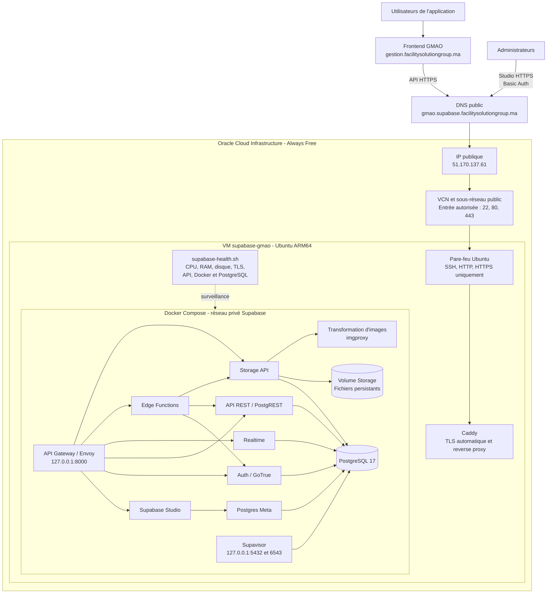

# Architecture du backend Supabase sur Oracle Cloud

## Principes de sécurité

- Seuls SSH (`22`), HTTP (`80`) et HTTPS (`443`) sont accessibles depuis Internet.
- Caddy redirige HTTP vers HTTPS et renouvelle automatiquement le certificat TLS.
- La passerelle Supabase (`8000`) et PostgreSQL/Supavisor (`5432`, `6543`) écoutent uniquement sur `127.0.0.1`.
- Supabase Studio est protégé par un nom d'utilisateur et un mot de passe distincts des comptes de l'application.
- Les secrets restent dans `/home/ubuntu/supabase-project/.env` et ne sont jamais intégrés au dépôt Git.

## Persistance et surveillance

- PostgreSQL conserve les tables, Auth, fonctions RPC, triggers et politiques RLS dans un volume Docker persistant.
- Storage conserve les métadonnées dans PostgreSQL et les fichiers dans le volume Storage de la VM.
- Le script `/home/ubuntu/supabase-health.sh` contrôle les ressources et la disponibilité des services.
- Les sauvegardes de migration restent séparées de l'instance et doivent être complétées par des sauvegardes périodiques.
