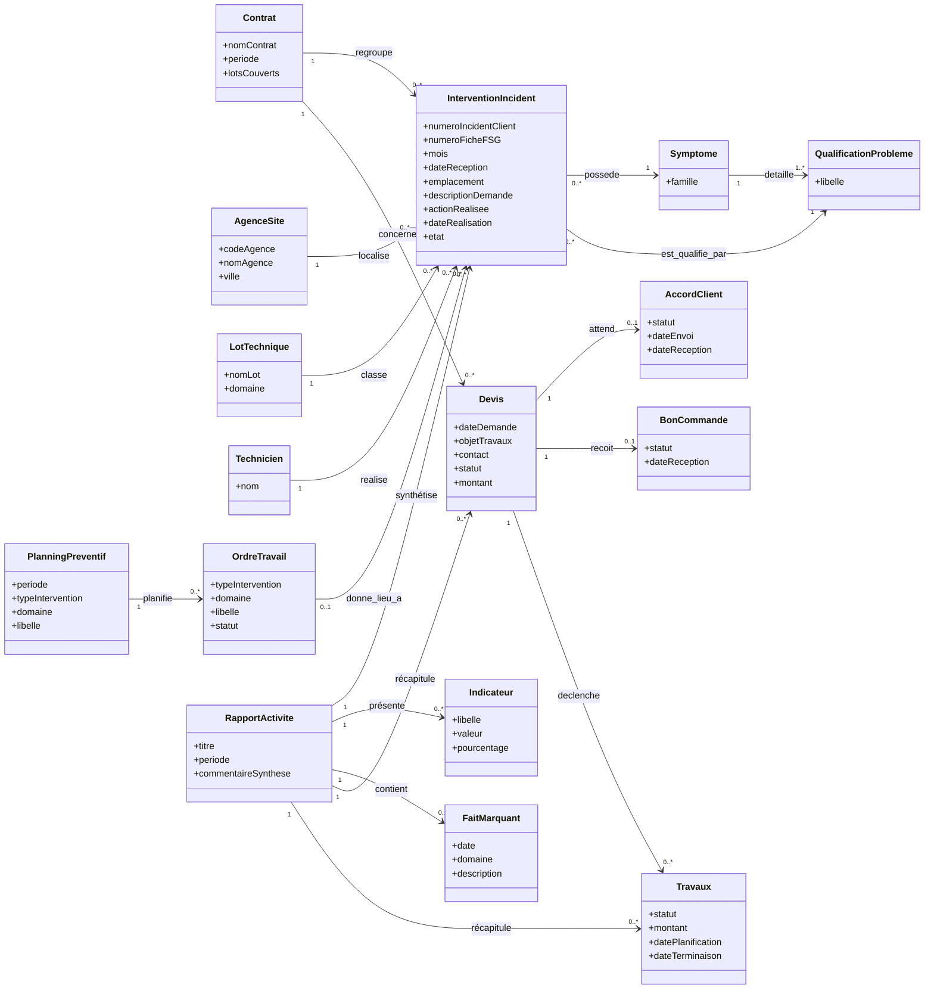
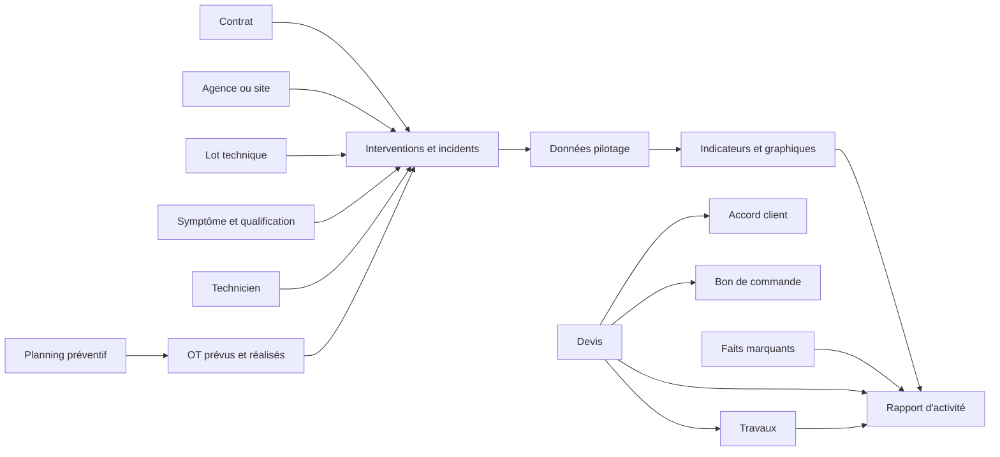

# Diagramme de classes — Objets du rapport Excel

Ce diagramme représente uniquement les objets métier observés dans le fichier Excel **Rapport Quadrimestriel d'activité 2022 2023**.

Il s'agit d'une représentation conceptuelle : dans le fichier Excel, ces objets ne sont pas stockés dans des tables relationnelles séparées. Plusieurs informations sont répétées dans les lignes de la feuille `22.23` ou calculées dans les feuilles de synthèse.

## Diagramme principal

## Relations essentielles

Les relations les plus importantes du fichier Excel sont les suivantes :

1. Un **contrat** regroupe plusieurs interventions ou incidents.
2. Une **agence ou un site** permet de localiser plusieurs interventions.
3. Chaque intervention est classée dans un **lot technique**.
4. Chaque intervention possède un **symptôme** et une **qualification détaillée**.
5. Un **technicien** peut réaliser plusieurs interventions.
6. Le **planning préventif** permet de suivre les OT prévus, réalisés, non réalisés, relancés ou annulés.
7. Un **devis** peut recevoir un accord client et un bon de commande, puis déclencher des travaux.
8. Le **rapport d'activité** regroupe les interventions, indicateurs, faits marquants, devis et travaux d'une période.

## Flux simplifié du rapport Excel

## Correspondance avec les feuilles Excel

| Objet | Feuille principale |
|---|---|
| Intervention ou incident | `22.23` |
| Contrat, emplacement, lot et technicien | `22.23` |
| Agence, ville et états | `Feuil2` |
| Symptômes et qualifications | `Feuil3` et `Données pilotage` |
| Indicateurs mensuels | `Données pilotage` |
| Synthèse et graphiques | `Synthèse des interventions` |
| Analyse des demandes | `Demandes d'interventions` |
| Analyse par lot | `Corrective Lot 1 Electricité` et `Corrective LOT3` |
| Planning préventif | `PMP` |
| OT non réalisés, relancés ou annulés | `Annexe 1` |
| Devis, accords, bons de commande et travaux | `Devis et Travaux` et `Feuil2` |
| Faits marquants | `Faits marquants` |
| Rapport final | `Page de garde`, `Sommaire (2)` et autres feuilles de présentation |

## Remarque importante

Dans Excel, l'objet `InterventionIncident` mélange plusieurs concepts qui seraient normalement séparés dans une application : demande client, incident, ordre de travail et intervention réalisée. Cette simplification reflète le fonctionnement réel du fichier et non le modèle de données de `projectQrcode`.
